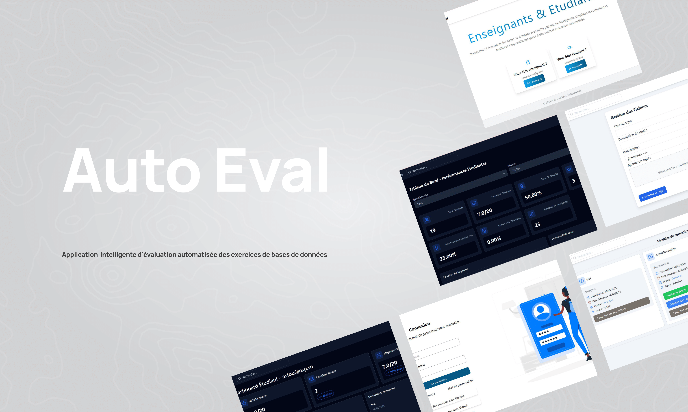
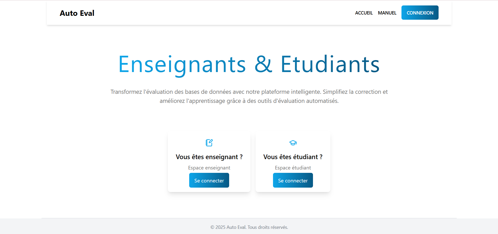
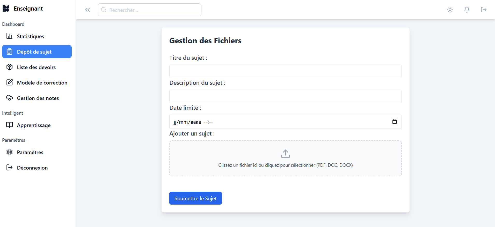
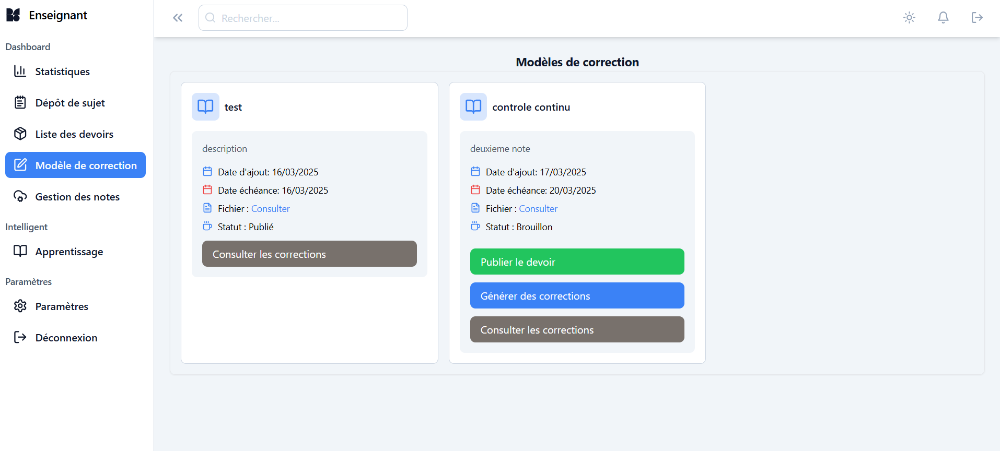
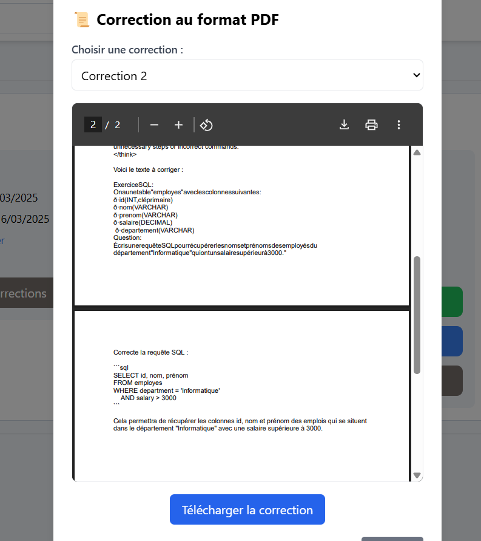

# Plateforme intelligente d'évaluation automatisée des exercices de bases de données

Projet de SGBD (sytème de gestion de base de données) réalisé en groupe à l'ESP

 


## Description

L'objectif de ce projet est de concevoir et développer une plateforme web permettant aux professeurs de déposer des sujets d’exercices en bases de données et aux étudiants de soumettre leurs réponses sous forme de fichiers PDF. Le projet intégrera un moteur d’intelligence artificielle basé sur DeepSeek via Ollama

#### Présentation PowerPoint: [click here](https://docs.google.com/presentation/d/1d46KOFQ03woHup8jB9OGuX279hMweZSu3i3uLnbdmrg/edit?usp=sharing)  <br>
#### Rapport de projet : [click here](https://docs.google.com/document/d/1mHV5iMTsdMGgk3-IY0vaUpcdU9FVqR830LmGinHtauU/edit?usp=sharing)


## Equipe projet

|Nom       |Prenom         |Mail                                                        |
|----------|---------------|------------------------------------------------------------|
|BA        |Aminata        |[aminataba@esp.sn](mailto:aminataba@esp.sn)                 |
|DIAGNE    |Yacine FALL    |[yacinefalldiagne@esp.sn](mailto:yacinefalldiagne@esp.sn)   |
|KANDJI    |Abdoul Aziz    |[abdoulazizkandji@esp.sn](mailto:abdoulazizkandji@esp.sn)   |
|SAGNE     |Aicha          |[aichasagne@esp.sn](mailto:aichasagne@esp.sn)               |
|SYLLA     |Dié            |[diesylla@esp.sn](mailto:diesylla@esp.sn)                   |

## Live demo

 Consultez la démo ici 👉️ <!-- [https://mosaic.cruip.com/](https://mosaic.cruip.com/) -->

## Pré-requis


### Technologies utilisées


#### 1. Front End :
  React JS
  Tailwind CSS
  
#### 2. Back End :
  Node JS (Express)
  
#### 3. Database:
  MongoDB

#### 4. IA et NLP:
  Ollama + DeepSeek

#### 5. Sécurité
  OAuth2
  Chiffrement des fichiers 
  Détection de plagiat


### Installation
``` bash
# clone the repo
$ git clone https://github.com/yacinefalldiagne/Projet_SGBD_AutoEvalDB.git my-project

# go into client's directory
$ cd my-project/client

# install client's dependencies
$ npm install

# go into server's directory
$ cd my-project/server

# install server's dependencies
$ npm install
```

## Snapshots

1. Accueil
   
    

<!--  -->

2. Login page
   
    

<!--  -->

3.Register

    
    

4.Dashboard Enseignant


   
   

 4.1. Liste des Devoir
 
 
 4.2. Modele de Correction
 
 
   

   
    
 4.3. Gestion des notes 
 
 4.4. Apprentissage
 
 4.5. Statistique 
 


4.Dashboard Etudiant


 
 
 

 


